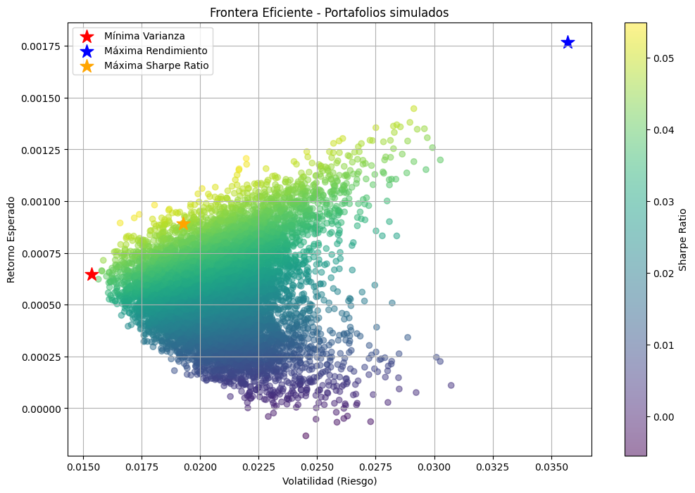

# Optimización de Portafolio con el Modelo de Markowitz

Este proyecto implementa el modelo de media-varianza propuesto por Harry Markowitz para construir portafolios óptimos de inversión. Utiliza precios históricos de distintas acciones listadas en EE.UU. para simular portafolios aleatorios y graficar la frontera eficiente, así como identificar el portafolio con mejor relación riesgo-retorno (Sharpe ratio).

## Objetivo

- Simular múltiples combinaciones de portafolios de activos financieros.
- Calcular retornos esperados y volatilidades.
- Visualizar la frontera eficiente.
- Determinar el portafolio con la máxima Sharpe Ratio.

## Metodología

1. Descarga de precios históricos con `yfinance` para activos seleccionados.
2. Cálculo de retornos diarios, anualizados y matriz de covarianzas.
3. Simulación de 5,000 portafolios con pesos aleatorios.
4. Cálculo de retorno esperado, riesgo y ratio de Sharpe para cada uno.
5. Visualización de la **frontera eficiente** y del **portafolio óptimo**.

## Herramientas y librerías

- `Python`
- `pandas`, `numpy`
- `matplotlib`
- `yfinance`
- `random`, `math`

## Resultados

- Gráfico con miles de portafolios simulados y su relación riesgo-retorno.
- Identificación del portafolio con mayor Sharpe Ratio.
- Muestra de la distribución de pesos en el portafolio óptimo.

## Conclusión

El modelo de Markowitz, aunque teórico, permite comprender el trade-off entre retorno y riesgo. Este enfoque puede escalarse para incluir restricciones reales (short selling, rebalanceo) o compararse con otros modelos (Black-Litterman, CVaR).

## Estructura del proyecto

- `markowitz_portfolio.ipynb`: notebook con el código completo.
- `/images`: gráficos exportados desde el análisis.
- `README.md`: descripción del proyecto y pasos clave.

## Licencia

MIT License
